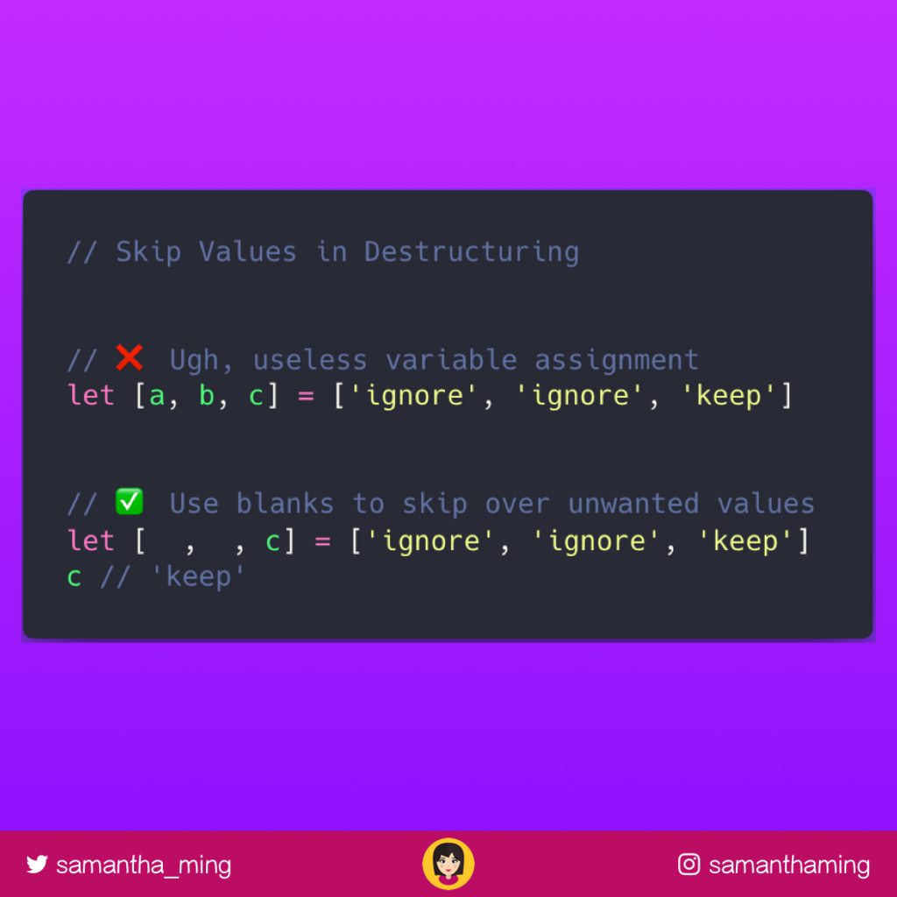

# 3. Destructuring

Destructuring makes it super easy for you to extract the values from an array or an object into their own variable.

This is one of my favorite ES6 feature. Make sure you understand destructuring. It really helps clean up your code and make it more readable!

## Object Destructuring

```javascript
const person = {  
  name: 'samantha',
  twitter: 'samantha_ming',
  instagram: 'samanthaming',
  action: 'follow her for JS, HTML, CSS Tips!'
};

// Old way
const name = person.name;
const twitter = person.twitter;
const instagram = person.instagram;

// ES6 way
const {name, twitter, instagram} = person;

// Same output for both ways
console.log(name, twitter, instagram);
/*
  "samantha"
  "samantha_ming"
  "samanthaming"
*/
```

## Array Destructuring

```javascript
const berries = [
  'blueberry',
  'strawberry',
  'raspberry'
];

// Old way
const blue = berries[0];
const straw = berries[1];
const rasp = berries[2];

// ES6 way
const [blue, straw, rasp] = berries;

// Same output for both ways
console.log(blue, straw, rasp);
/*
  "blueberry",
  "strawberry",
  "raspberry"
*/
```

## Default Value in Object Destructuring

You can use `=` to assign a default value.
If you don't assign a default value and you try to destructure a value that doesn't exist, you will get `undefined`.

```javascript

const person = {
  name: 'samantha',
  twitter: 'samantha_ming',
  instagram: 'samanthaming',
  // snapchat: '👻'
  action: 'follow her for JS, HTML, CSS Tips!',
};

const {
  name,
  snapchat = 'no snapchat'
} = person;

console.log(name, snapchat);
/*
  "samantha"
  "no snapchat"
*/
```

## Default Value in Array Destructuring

```javascript
const berries = [
  'one' 
  // 'two'
];

const [
  blue, 
  straw = 'berry'
] = berries;

console.log(blue, straw);
/*
  "one"
  "berry"
*/
```

## Rename Variable Name

You use `:` to assign a new variable name.

```javascript
const person = {
  name: 'samantha',
  twitter: 'samantha_ming',
  instagram: 'samanthaming',
  action: 'Follow her for JS, HTML, CSS Tips!',
};

const {
  action:cta
} = person;

console.log(cta); // Follow her for JS, HTML, CSS Tips!

// Now `action` won't work cause you assigned it to a renamed variable
console.log(action); // ReferenceError: action is not defined
```

### Mixing rename + default

```javascript
const person = {
  name: "samantha",
  twitter: "samantha_ming",
  instagram: "samanthaming",
  // action: "Follow her for JS, HTML, CSS Tips!",
};

const {
  action:cta = "samantha is the best"
} = person;

console.log(cta); // "samantha is the best"

// Again `action` won't work cause you assigned it to a renamed variable
console.log(action); // ReferenceError: action is not defined
```

## Swapping Variables with Array Destructuring

With destructuring, you can easily swap two values without needing to creating a temporary variable.


More info [Code Tidbit: Swap Variables with Destructuring](http://www.samanthaming.com/tidbits/8-swap-variables-with-destructuring)

## Skipping Variables in Array Destructuring

You can you blank values to ignore return values that you don't care about.



More info [Code Tidbit: Skip Values in Destructuring](http://www.samanthaming.com/tidbits/13-skip-values-in-destructuring)
